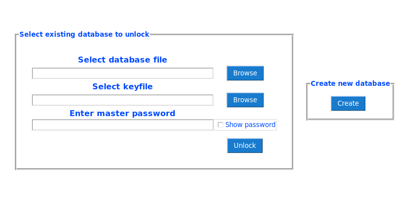

<h1>Castle - A Python password manager</h1>

Castle is a simple password manager written in python.

<h2>How it works</h2>

Castle makes use of sqlite3 databases to store your data and gpg symmetric encryption on both the files and field level.

When a new database is created it also generates a "keyfile" - an encrypted text file required to decrypt any passwords etc stored in database tables.

Accessing any data stored within your database requires both your master password and this "keyfile".

This creates an opportunity to treat this "keyfile" like a multifactor authentication token. the intention is for the keyfile to be stored separately from the database file (for example on a usb pen).

If for any reason you think your keyfile may have been compromised there is an option to generate a new keyfile when you change your master password.

The interface is a simple and intuitive dashboard style.

A password genarator is included with selectable charactersets to quickly generate strong passwords and copy them directly to your clipboard.

The program itself is capable of storing standard password style data, secure notes for longer messages and also files - all fully encrypted for peace of mind.

<h2>How to use</h2>

1. On first running the program you will see the login screen, with options to open an existing database or create a new one, click "Create" to start a new database"
This will generate 2 files. One is your database file, this stores all your information and should be backed up in case of data corruption or hardware failure. 
The second is a "keyfile", an encrypted text file that is required to open your database. This file should also be backed up but for best security should NOT be stored in the same place
as the database file. Remember, if someone ever gets your master password it would be useless to them unless they have both of these files.

2. You will now be asked to select where you want to create your new files, and to create a strong master password for your database. 
At this stage you can also select the database style you wish. Select "Basic" for a simpler database consisting of "Credit card", "Files", "Logins", and "Secure note" tables or 
"Full" for a more elaborate database structure. Keep in mind you can add or remove tables as you wish so there's no need to restrict yourself to these starting templates. 
Once you have everything set how you wish click "Create now".

4. You will now be logged into your new database, and can navigate between tables using the nav bar at the left side of the display, and control the contents of tables 
using the control panel which appears at the bottom of the display when viewing a table.

5. Should you wish to add custom tables to your database simply select the entry in the navbar on the left and the add table window will open. 
Give your new table a name and select one of the predefined table templates or just enter your desired column headings (separated by commas) in the appropriate text box and click "Ok". 
Whether created from a template or custom you can add or remove columns from tables as you wish to tailor your database to your needs.

6. To generate a strong password for an account again simply select the password genarator from the nav bar on the left and the generator window will open. 
Select the character sets you wish to use then choose the length of passord you want, either by moving the dragbar or typing in the appropriate box, then click "Generate". A
random password will be created using your selection, click the "Copy password" button to copy this to your clipboard for use.

7. To save a new entry to a table select the table from the navbar and select "Add entry" from the control panel. This will open a new erntry window, enter your desired information and click "Submit"

8. To update the password for your database file select the "Change master pass" option from the navbar on the left and the appropriate window will open. 
Enter and confirm your new password. You will also have the option to generate a new keyfile at this point, keep in mind you will need to replace any backups with the new files. 
Once you are satisfied everything has been entered correctly click "Ok" and your details will be updated.

<h2>Installation</h2>

<h2>Linux</h2>

<h3>Debian:-</h3>

Ensure you have python 3.8 and pip3 installed on your system, if not install with

    sudo apt-get install python3 pip

Clone the repository

    git clone https://github.com/J-Mathers/Castle.git

Move into the downloaded directory

    cd ./Castle

Install tkinter if not present

    sudo apt install python3-tk

Install xclip and xsel to handle copying passwords to clipboard

    sudo apt install xclip xsel

Install neeed python packages

    pip3 install -r requirements.txt

Then simply run the script "castle.py"

    ./castle.py

<h3>Fedora:</h3>

Ensure you have python 3.8 and pip3 installed on your system, if not install with

    sudo dnf install python3 pip

Clone the repository

    git clone https://github.com/J-Mathers/Castle.git

Move into the downloaded directory

    cd ./Castle

Install tkinter if not present

    sudo dnf install python3-tkinter

Install xclip and xsel to handle copying passwords to clipboard

    sudo dnf install xclip xsel

Install neeed python packages

    pip install -r requirements.txt

Then simply run the script "castle.py"

    ./castle.py

<h2>Windows</h2>

Install python 3.8 or higher from the Microsoft Store

Make sure this installation included pip by opening a command prompt window and executing

    pip --version

If this gives a program version pip is installed on your system and you may proceed

If not you may have to install pip [using these instructions](https://pip.pypa.io/en/stable/installing/)

Install the latest version of gpg4win from https://www.gpg4win.org/

Install needed python packages - from a command prompt window execute

    pip install -r <path/to/file>win-requirements.txt
    e.g.
    pip install -r C://Users/ThisUser/Documents/win-requirements.txt

Now simply right click the script, select "open with" and chooose python

<h2>Licensing</h2>

This software is released under the GNU GPLv3 licence

